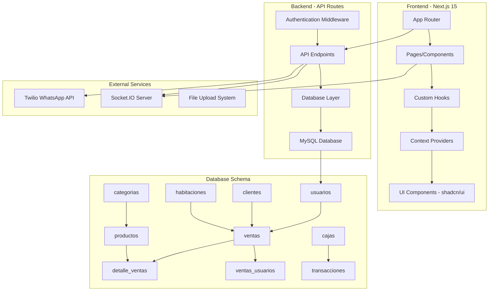

# Análisis Completo del Proyecto Admin Dashboard

## Resumen Ejecutivo

**AdminPro** es una aplicación web de gestión administrativa desarrollada con Next.js 15, TypeScript y MySQL. El sistema está diseñado para manejar operaciones de un negocio de servicios (posiblemente un bar/restaurante con habitaciones), incluyendo ventas, gestión de personal, finanzas y servicios.

## Arquitectura del Sistema



## Stack Tecnológico

### Frontend
- **Framework**: Next.js 15.2.4 con App Router
- **Lenguaje**: TypeScript 5
- **Estilos**: Tailwind CSS 3.4.17
- **UI Components**: shadcn/ui (Radix UI)
- **Iconos**: Lucide React, FontAwesome
- **Estado**: React Hooks + Context API
- **Formularios**: React Hook Form + Zod
- **Notificaciones**: Sonner, SweetAlert2

### Backend
- **API**: Next.js API Routes
- **Base de Datos**: MySQL 2 (mysql2)
- **Autenticación**: JWT (jsonwebtoken)
- **Validación**: Zod
- **Comunicación en Tiempo Real**: Socket.IO

### Servicios Externos
- **WhatsApp**: Twilio API
- **Archivos**: Sistema de upload local
- **Reportes**: jsPDF, xlsx

## Módulos Principales

### 1. **Gestión de Usuarios** (`/users`)
- CRUD completo de usuarios/empleados
- Roles y permisos
- Información personal y laboral (RUN, salario, AFP, etc.)
- Sistema de fotos de perfil

### 2. **Gestión de Ventas** (`/sales`)
- Registro de ventas con múltiples productos
- Asignación de anfitrionas/meseros
- Métodos de pago (efectivo, tarjeta, transferencia)
- Sistema de propinas y comisiones
- **Funcionalidad Especial**: Sistema de anulación vía WhatsApp

### 3. **Sistema de Caja** (`/cash-register`)
- Apertura y cierre de cajas
- Seguimiento de transacciones por método de pago
- Reportes financieros en tiempo real
- Control de múltiples cajeros

### 4. **Gestión de Productos** (`/products`)
- Catálogo de productos con categorías
- Precios y comisiones
- Sistema de imágenes
- Búsqueda y filtros

### 5. **Gestión de Clientes** (`/clients`)
- Base de datos de clientes
- Historial de compras
- Información de contacto

### 6. **Gestión de Habitaciones** (`/rooms`)
- Control de habitaciones/espacios
- Estados y disponibilidad
- Asignación a ventas

### 7. **Recursos Humanos**
- **Roles** (`/roles`): Sistema de permisos
- **Asistencias** (`/attendance`): Control de horarios
- **Planillas** (`/payroll`): Gestión de nómina
- **Horas Extras** (`/overtime`): Control de tiempo extra

### 8. **Finanzas**
- **Propinas** (`/tips`): Distribución de propinas
- **Comisiones** (`/commissions`): Cálculo de comisiones
- **Anticipos** (`/advances`): Adelantos de sueldo
- **Devoluciones** (`/returns`): Gestión de devoluciones

## Características Técnicas Destacadas

### 1. **Sistema de Anulación Inteligente**
- Integración con WhatsApp vía Twilio
- Notificaciones en tiempo real con Socket.IO
- Modal personalizado para confirmaciones
- Actualización automática de interfaces

### 2. **Arquitectura de Hooks Personalizados**
- `useSales`: Gestión completa de ventas
- `useCaja`: Control de cajas registradoras
- `useCurrentUser`: Autenticación y usuario actual
- Patrón consistente de loading/error/data

### 3. **Sistema de Tipos Robusto**
- Interfaces TypeScript bien definidas
- Validación con Zod en frontend y backend
- Mapeo consistente entre DB y aplicación

### 4. **Middleware de Autenticación**
- JWT con soporte para cookies y headers
- Protección de rutas API
- Manejo de sesiones

## Base de Datos

### Tablas Principales
- **usuarios**: Empleados del sistema
- **ventas**: Transacciones de venta
- **detalle_ventas**: Items de cada venta
- **ventas_usuarios**: Relación many-to-many ventas-usuarios
- **productos**: Catálogo de productos
- **clientes**: Base de datos de clientes
- **habitaciones**: Espacios/habitaciones
- **cajas**: Cajas registradoras
- **categorias**: Categorías de productos

### Relaciones Clave
- Ventas → Clientes (many-to-one)
- Ventas → Habitaciones (many-to-one)
- Ventas → Usuarios (many-to-many)
- Productos → Categorías (many-to-one)
- Detalles → Ventas (many-to-one)
- Detalles → Productos (many-to-one)

## Configuración del Entorno

### Variables de Entorno Requeridas
```env
# Base de Datos
DB_HOST=localhost
DB_USER=root
DB_PASSWORD=
DB_NAME=nuwesoft
DB_PORT=3307

# Twilio WhatsApp
TWILIO_ACCOUNT_SID=
TWILIO_AUTH_TOKEN=
TWILIO_WHATSAPP_NUMBER=
ADMIN_WHATSAPP_NUMBER=

# URLs
NEXT_PUBLIC_BASE_URL=
NEXT_PUBLIC_SOCKET_URL=
```

## Flujos de Trabajo Principales

### 1. **Flujo de Venta**
1. Apertura de caja por cajero
2. Selección de cliente y productos
3. Asignación opcional de anfitrionas
4. Cálculo automático de comisiones y propinas
5. Registro en base de datos
6. Actualización automática de caja

### 2. **Flujo de Anulación**
1. Solicitud de anulación desde interfaz
2. Envío de notificación WhatsApp al administrador
3. Respuesta del administrador (aprobar/rechazar)
4. Notificación en tiempo real vía Socket.IO
5. Actualización automática de la interfaz

### 3. **Flujo de Caja**
1. Apertura con monto inicial
2. Registro automático de transacciones
3. Seguimiento en tiempo real
4. Cierre con balance final
5. Generación de reportes

## Fortalezas del Sistema

### 1. **Arquitectura Moderna**
- Next.js 15 con App Router
- TypeScript para type safety
- Componentes reutilizables con shadcn/ui

### 2. **UX/UI Excelente**
- Diseño responsive y moderno
- Navegación intuitiva con sidebar organizado
- Feedback visual consistente

### 3. **Funcionalidades Avanzadas**
- Sistema de anulación vía WhatsApp único
- Tiempo real con Socket.IO
- Gestión completa de finanzas

### 4. **Código Bien Estructurado**
- Separación clara de responsabilidades
- Hooks personalizados reutilizables
- Tipos TypeScript bien definidos

## Áreas de Mejora Identificadas

### 1. **Seguridad**
- Implementar rate limiting en APIs
- Validación más estricta de permisos por rol
- Encriptación de datos sensibles
- Logs de auditoría

### 2. **Performance**
- Implementar paginación en listas grandes
- Optimización de queries de base de datos
- Lazy loading de componentes
- Caché de datos frecuentes

### 3. **Escalabilidad**
- Separar Socket.IO en servidor independiente
- Implementar Redis para sesiones
- Optimizar estructura de base de datos
- Implementar CDN para archivos estáticos

### 4. **Monitoreo**
- Sistema de logs estructurados
- Métricas de performance
- Alertas automáticas
- Dashboard de monitoreo

### 5. **Testing**
- Tests unitarios para hooks
- Tests de integración para APIs
- Tests E2E para flujos críticos
- Cobertura de código

### 6. **Documentación**
- API documentation con Swagger
- Guías de usuario
- Documentación técnica completa
- Diagramas de flujo actualizados

## Recomendaciones Técnicas

### Corto Plazo (1-2 meses)
1. **Implementar sistema de logs**: Winston o similar
2. **Agregar validación de permisos**: Middleware de autorización
3. **Optimizar queries**: Índices en base de datos
4. **Implementar tests básicos**: Jest + Testing Library

### Mediano Plazo (3-6 meses)
1. **Migrar a arquitectura de microservicios**: Separar módulos críticos
2. **Implementar caché**: Redis para datos frecuentes
3. **Sistema de backup automatizado**: Base de datos y archivos
4. **Monitoreo avanzado**: Prometheus + Grafana

### Largo Plazo (6+ meses)
1. **App móvil**: React Native o Flutter
2. **Integración con sistemas externos**: Contabilidad, inventario
3. **IA para análisis**: Predicciones de ventas, optimización
4. **Multi-tenancy**: Soporte para múltiples empresas

## Conclusión

AdminPro es un sistema robusto y bien diseñado que demuestra buenas prácticas de desarrollo moderno. La arquitectura es sólida, el código es mantenible y las funcionalidades cubren las necesidades del negocio de manera integral.

Las características únicas como el sistema de anulación vía WhatsApp y la gestión completa de finanzas lo distinguen como una solución especializada y valiosa.

Con las mejoras recomendadas, el sistema puede escalar eficientemente y mantener su competitividad en el mercado.